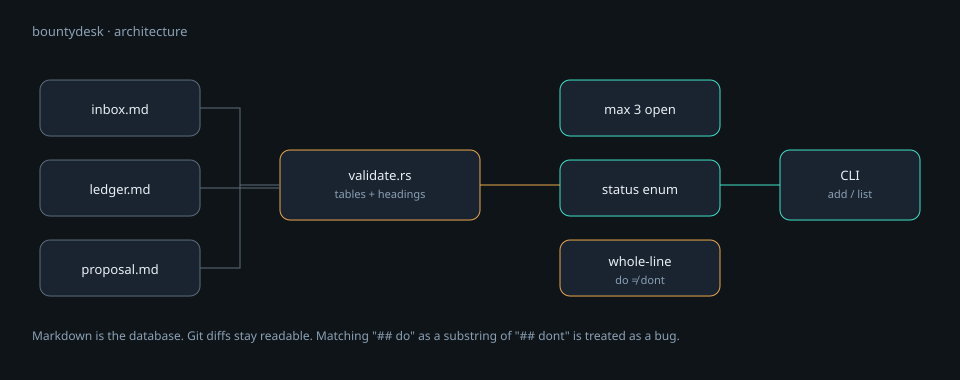

<p align="center">
  
</p>

<h1 align="center">bountydesk</h1>

<p align="center">
  <strong>A personal desk for ecosystem bounties, RFPs, and small paid tasks.</strong><br>
  Markdown inbox, a cap of three open rows, a five-heading proposal. Not a marketplace.
</p>

<p align="center">
  <a href="README.md"><strong>English</strong></a> ·
  <a href="README.zh-CN.md">中文</a> ·
  <a href="learn/README.md">Learn</a> ·
  <a href="docs/PROJECT-PLAN.md">Plan</a> ·
  <a href="SECURITY.md">Security</a>
</p>

<p align="center">
  
  
  
  
</p>

---

Boards already list “do X, get $Y”. This repo is the desk next to those boards: a short inbox, a ledger of what you shipped, and a one-page proposal template. Cash from isomorphic work (read-only CLIs, watchers, docs + small tools) can feed [hlsentry](https://github.com/toolazytoname/hlsentry), [oddsradar](https://github.com/toolazytoname/oddsradar), and [chaintail](https://github.com/toolazytoname/chaintail). Bounties are not the identity.

> This is **not** a product company and **not** a bounty marketplace. Superteam, Gitcoin, and foundation RFPs already exist. bountydesk keeps *your* queue honest.

## Why this exists

Solo builders lose money in two boring ways: taking four tasks at once, and sending a vision essay where the buyer wanted a demo. The inbox cap (3) and the five headings are process, encoded so `cargo test` can fail you before a program manager does.

## Features

| | |
|---|---|
| **Markdown as the database** | `docs/inbox.md` and `docs/ledger.md`. Git-friendly, human-editable. |
| **Open-inbox cap** | At most **3** rows whose `decision` is empty / `considering` / `accepted` / `in-progress`. |
| **Proposal skeleton** | Whole-line headings: `problem`, `do`, `dont`, `demo`, `milestones`. |
| **Substring trap closed** | `## do` is a prefix of `## dont`. Matching is the first token of the heading line, not `contains`. |
| **Secret hygiene** | Column names like `private_key` are rejected and never written. |

## How it works

<p align="center">
  
</p>

The validator returns **all** errors, not the first one. A proposal missing three headings should show three lines.

## Requirements

- [Rust](https://www.rust-lang.org/tools/install) **1.85**

```bash
git clone https://github.com/toolazytoname/bountydesk.git
cd bountydesk
cargo test
```

## Quick start

```bash
cargo run -- list inbox
cargo run -- validate --proposal docs/proposal.example.md
cargo run -- validate --proposal fixtures/proposal-no-do.md   # must fail: missing heading do
```

Add a row (will be rejected if you already have three open):

```bash
cargo run -- add-inbox \
  --opened 2026-08-18 \
  --platform gitcoin \
  --title demo \
  --link https://example.com \
  --amount 500 \
  --due 2026-09-01 \
  --isomorphic yes
```

Scaffold a blank proposal:

```bash
cargo run -- proposal --out /tmp/proposal.md
```

## Tables

**Inbox** (`docs/inbox.md`):

| Column | Notes |
|---|---|
| `opened` | Date you noticed the task. |
| `platform` | gitcoin / superteam / foundation / … |
| `title` / `link` / `amount` / `due` | As on the board. |
| `isomorphic` | `yes` only if the work matches read-only CLI / watcher / docs+tooling. |
| `decision` | Occupies a slot unless it is a closed state. |

**Ledger** (`docs/ledger.md`): `date`, `platform`, `title`, `link`, `status`, `amount`.

**Proposal headings** (whole line, in any order, all required):

```markdown
## problem
## do
## dont
## demo
## milestones
```

`fixtures/proposal-no-do.md` has `## dont` and no `## do`. That used to pass a naive substring check. It must not.

## CLI

| Command | Purpose |
|---|---|
| `list inbox` / `list ledger` | Print rows as JSON plus a count. |
| `add-inbox …` | Append one inbox row; enforce the cap. |
| `add-ledger …` | Append a ledger row. |
| `validate [--proposal FILE]` | Check inbox, ledger, and optional proposal. |
| `proposal --out FILE` | Write the five-heading skeleton. |

`--inbox` / `--ledger` override the default `docs/*.md` paths.

## Tests

```bash
cargo test
```

The important unit is `heading_tokens` plus `test_missing_do_not_satisfied_by_dont`. Domain words that enter string matching have to be treated as an attacker would treat them.

## Security

Read **[`SECURITY.md`](SECURITY.md)**. Never paste seeds, exchange API secrets, or other people’s production endpoints into these markdown files. If a listed task requires signing or holding user assets, refuse it.

## What belongs here

- A short list of open tasks you might take
- Notes after you submit or get paid
- One-page proposals that include a running demo

## Non-goals

- Custody, trading execution, or anything that can move someone else’s funds
- Three tasks in parallel (the cap is the product)
- Treat bounties as the only long-term business
- Scrape or spam every grant form without a running demo
- An LLM that writes empty proposals and submits them for you

## Learn

[`learn/`](learn/) is the industry map (bounty vs grant vs RFP vs hackathon) and the heading-token lesson. Cover animation: [`learn/assets/cover.mp4`](learn/assets/cover.mp4).

## Related

The isomorphic work this desk is meant to fund:

- [hlsentry](https://github.com/toolazytoname/hlsentry)
- [oddsradar](https://github.com/toolazytoname/oddsradar)
- [chaintail](https://github.com/toolazytoname/chaintail)

## License

[MIT](LICENSE) © 2026 toolazytoname
